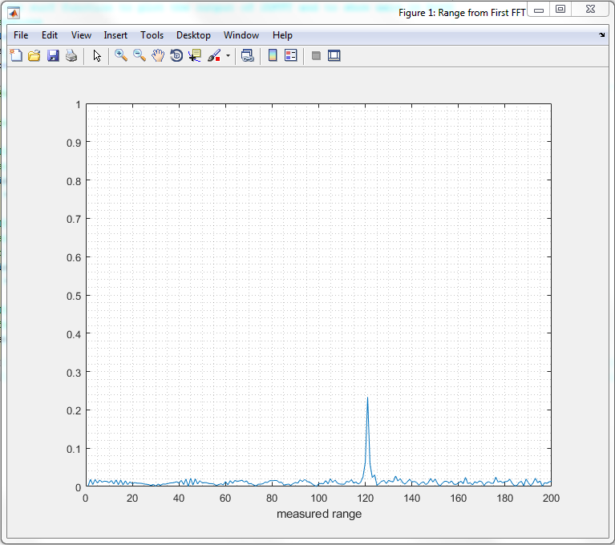
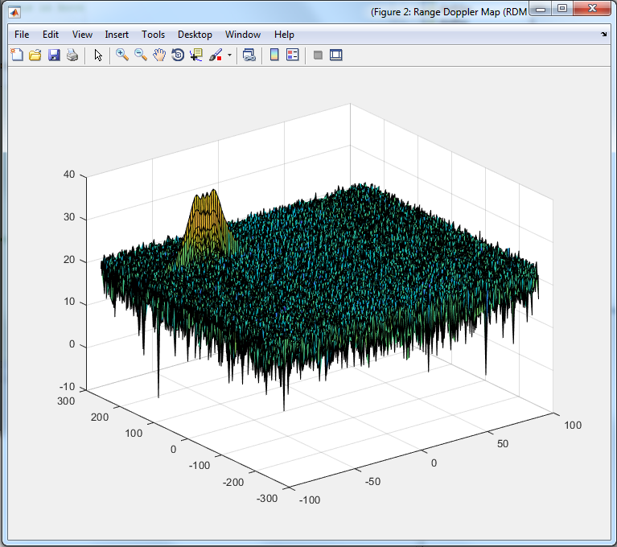
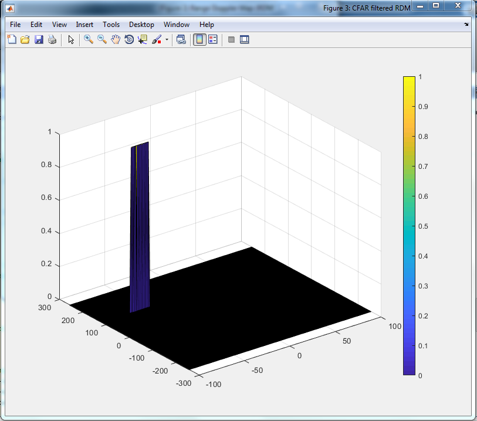

# SFND Radar Target Generation Detection

## 2D CFAR

For the implementation of 2D-CFAR Algorithm:

### CFAR Parameters

Setting the sizes of training and guard cells for each of the *v*elocity (doppler) and *d*istance (range) dimension based on a percentage their max values. This is done in lines 147-167.

~~~
% *%TODO* :
%Select the number of Training Cells in both the dimensions.
nCTdist = 10;       % 0.5 percent of the total range (200 m)
nCTv = 5;

% *%TODO* :
%Select the number of Guard Cells in both dimensions around the Cell under 
%test (CUT) for accurate estimation
nCGdist = 4;
nCGv = 2;

% *%TODO* :
% offset the threshold by SNR value in dB
offset = 1.4;
~~~

### CFAR Loop

First, a new matrix `CFARoutput` with the same size as `RDM` 512x128 is initialized with all zeros, this will avoid the issue of suppressing the non-thresholded cells at the edges.

Second, I iterate with `i, j` over the whole matrix starting from `1, 1` until before the end by double the training+guard size. This simulates a box-window moving through the whole `RDM` where the upper-left corner of this window is `i, j` and the cell under test (CUT) is the cell in the middle of the window `i+training+guard, j+training+guard`. 

For each window/iteration, the window values are extracted and converted from log space to linear space using `db2pow` and stored in `tCells`.

Next, the noise value `noiseVal` is computed according to the method provided in the lesson, and factored by the offset.

Finally, the CFARoutput value is determined accordingly either 1 or 0 depending on exceeding the threshold or not. Notice that the borders of the matrix which are not processed by the loop are already 0 from the initialization and this is how the point is addressed.

~~~
CFARoutput = zeros(size(RDM));

for j=1:Nd-2*(nCTdist+nCGdist)
    for i=1:Nr/2-2*(nCTv+nCGv)
        
        tCells = db2pow(RDM(i:i+2*(nCTv+nCGv),j:j+2*(nCGdist+nCTdist)));
        tCells(nCTv+1:end-nCTv,nCTdist+1:end-nCTdist) = 0;
        
        noiseVal(i,j) = pow2db(sum(sum(tCells))/nT);
        
        sigThresh = noiseVal(i,j)*offset;
        
        if RDM(i+(nCTv+nCGv),j+(nCTv+nCGdist))>sigThresh
            CFARoutput(i+(nCTv+nCGv),j+(nCTv+nCGdist)) = 1;
        else
            CFARoutput(i+(nCTv+nCGv),j+(nCTv+nCGdist)) = 0;
        end
        
    end
end
~~~

## Figures Output

FFT Determining Range (Peak at 120).

Range Doppler Map RDM.

CFAR Output Map

